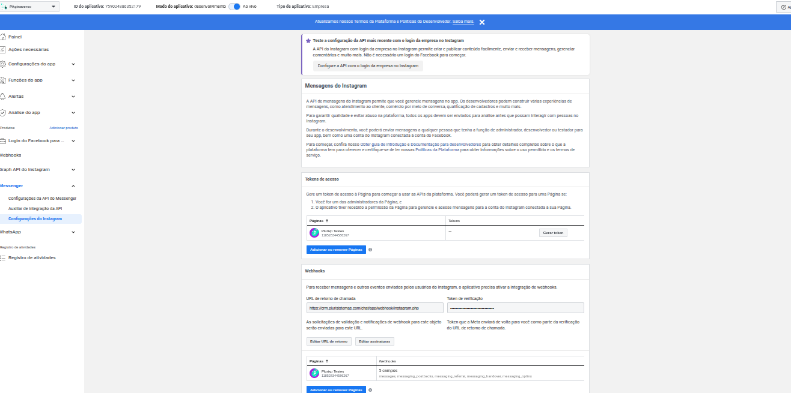
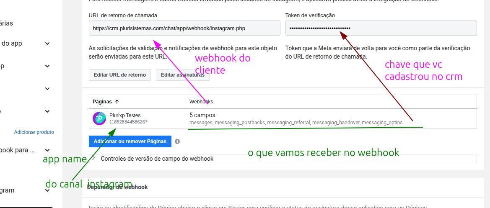

# Integração com Instagram

[Voltar](../README.md)

E vinculado ao messenger o mesmo token que vc gera para messenger vc usa para instagram

So que vc precisa da permissoes relacionada ao Instagram  instagram_manage_messages, instagram_basic
Então tambem precisa passar pela Analise do app 

Como exemplo deixo aplicativo 
[PAginaverso](https://developers.facebook.com/apps/759024886352179/dashboard/?business_id=793977428699585)

* Aqui voce vincula seu instagram o token que for gerado esse token vai ser mesmo para instagram e messenger é bom lembra
que é o mesmo ok 

As informações necessarias para fazer comunicação crm e meta funcionar 

Exemplo de pedido revisão de aplicativo que deu certo 
https://developers.facebook.com/apps/759024886352179/app-review/submissions/feedback/?submission_id=783628037225197&business_id=793977428699585

