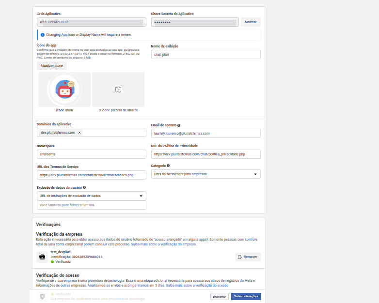
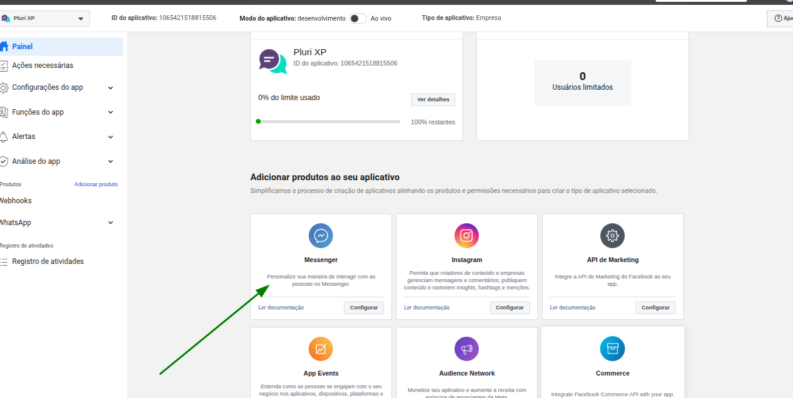
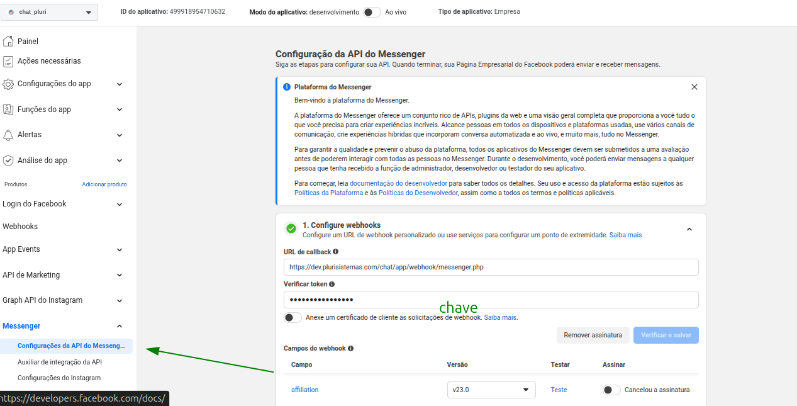
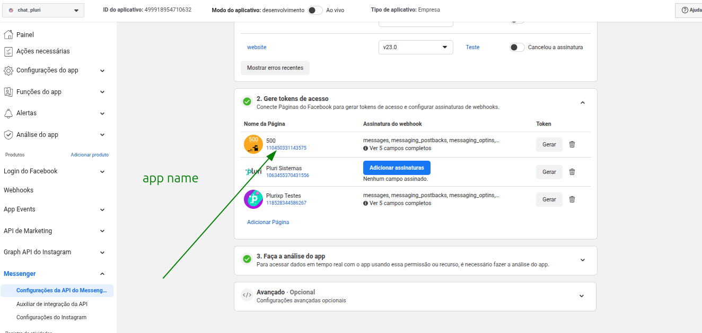
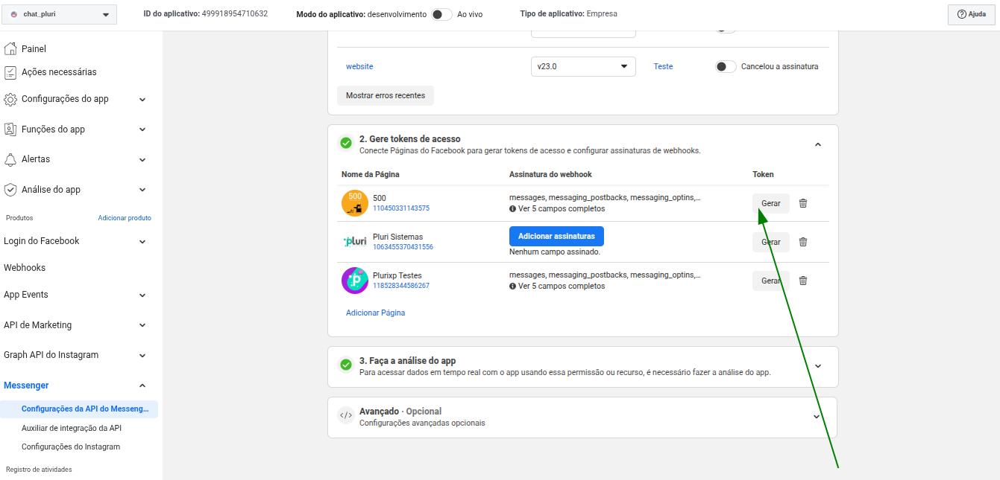
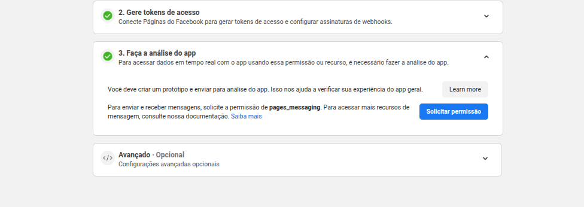

# Integração com Messenger

[Voltar](../README.md)

A integração com o Messenger requer atenção, pois o processo é mais demorado e depende da aprovação da Meta. O aplicativo precisa passar por análise e revisão antes de ser utilizado em produção.

## Por onde começar?

Certifique-se de que o aplicativo esteja corretamente configurado na seção Configurações do App, incluindo todas as informações obrigatórias e o ícone no tamanho adequado, garantindo que tudo esteja em conformidade antes do envio para revisão da Meta.

Aplicativo deixado de exemplo chat_pluri em relação ao messenger pois tem a permissao de homologada 

[chat_pluri](https://developers.facebook.com/micro_site/url/?click_from_context_menu=true&country=BR&destination=https%3A%2F%2Fdevelopers.facebook.com%2Fapps%2F499918954710632&event_type=click&last_nav_impression_id=0ueonFCeiRH4CsLRP&max_percent_page_viewed=96&max_viewport_height_px=1362&max_viewport_width_px=2732&orig_http_referrer=https%3A%2F%2Fdevelopers.facebook.com%2Fapps%2F499918954710632%2Fsettings%2Fbasic%2F%3Fbusiness_id%3D3804389239686015&orig_request_uri=https%3A%2F%2Fdevelopers.facebook.com%2Fapps%2F&region=latam&scrolled=false&session_id=1FYrQHjrt14NwOvPU&site=developers)

1. Primeiro vc adiciona o produto  no seu aplicativo 

    

2. Configure o webhook de acordo com o DNS. No campo de verificação de token, utilize o valor informado na chave dentro de "Canais de Chat" do CRM. Esse processo é necessário para validar o webhook do cliente.

    

3. Preencher as informações app name em canais de chat do CRM  

    

4. Preencher as informações token em canais de chat do CRM  
    

Para enviar e receber mensagens, solicite a permissão de pages_messaging.

Exemplo de pedido revisao de aplicativo que deu certo

[Link](https://developers.facebook.com/apps/499918954710632/app-review/submissions/feedback/?submission_id=920029582699565&business_id=3804389239686015)