# Integração com WhatsApp (Meta)

A integração com o WhatsApp exige atenção, pois envolve várias etapas para ser concluída corretamente.
É essencial que o aplicativo tenha as permissões adequadas no ambiente **Meta** do cliente; caso contrário, a integração não funcionará.

---

## Por onde começar?

### 1. Adicionar o produto

No ambiente Meta, adicione o produto **WhatsApp** ao aplicativo.

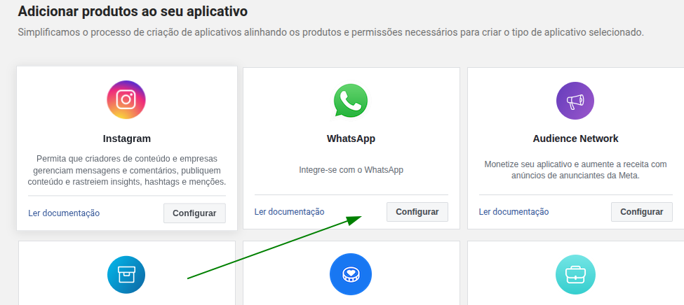

---

### 2. Configuração da API e verificação do número

Após adicionar o produto, acesse a seção de **Configuração da API**.

* Adicione um número de telefone e realize o processo de verificação.
* **Atenção**: Caso o número seja adicionado sem cartão de crédito, não será possível realizar envios ativos, nem mesmo para testes.

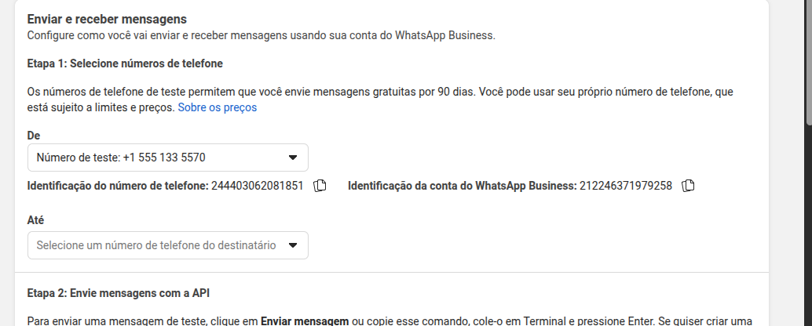
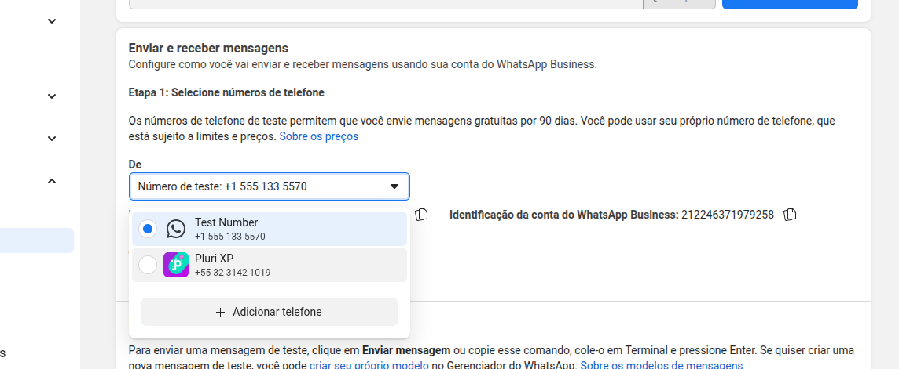

---

### 3. Configuração do Webhook

Na aba **Configuração** (logo abaixo de Configuração da API), configure o Webhook.

* Utilize o **DNS do cliente** para definir a URL de callback.
* No campo de verificação de token, insira o valor presente na chave em **Canais de Chat** da plataforma CRM.

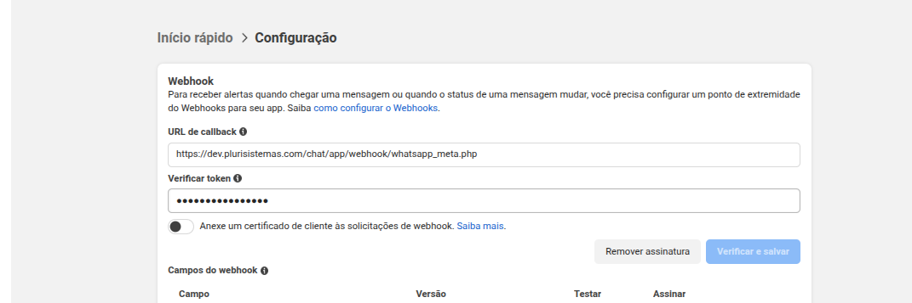

Ative as assinaturas para receber os eventos necessários via Webhook:

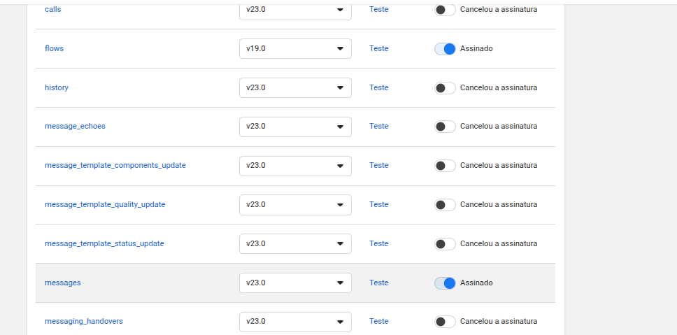

---

### 4. Criação de Token Definitivo

Para gerar o token permanente da **WhatsApp Business API**:

1. Acesse: **Gerenciar WhatsApp → Configurações → Usuários do Sistema**
2. Crie um novo usuário com privilégios de **Admin**.

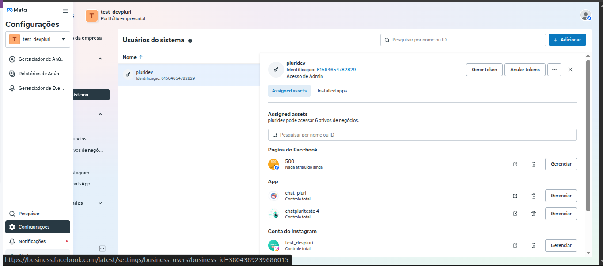
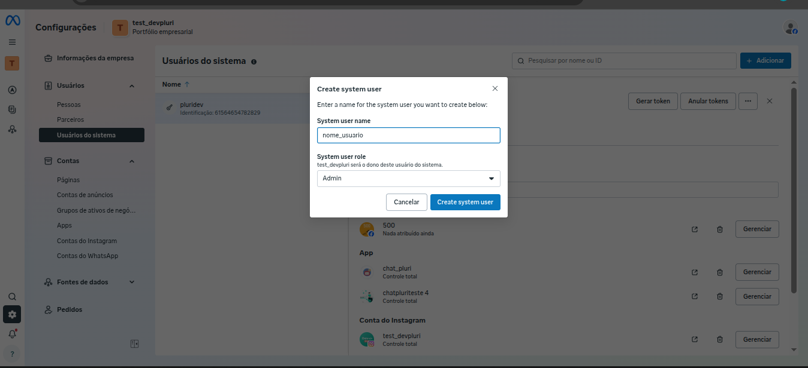

3. Após criar o usuário, adicione-o às funções do aplicativo utilizando o **ID**:

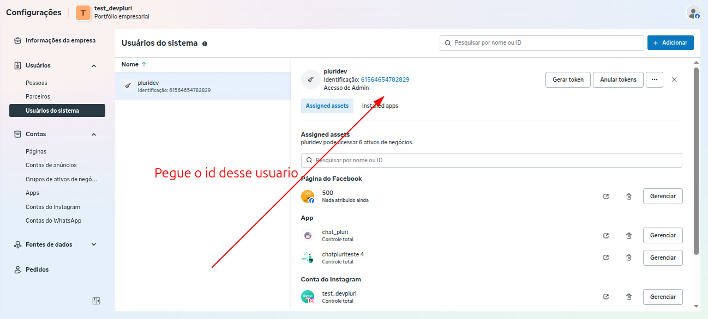
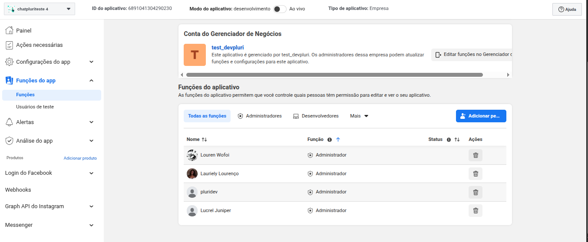

4. Em seguida, volte para **Gerenciar WhatsApp** e clique em **Gerar Token**.

   * Esse token deve ser inserido na plataforma, em **Canais de Chat → Campo Token**.
   * Caso solicitado, habilite as permissões:

     * `whatsapp_business_messaging`
     * `whatsapp_business_management`
     * `business_management`

5. Selecione os ativos necessários para que o WhatsApp funcione corretamente.

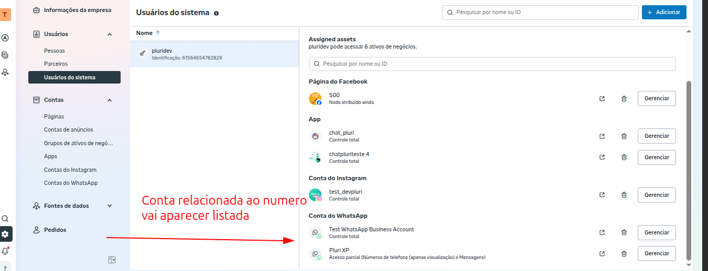

---

### 5. Finalização da Integração

Após concluir os passos acima, a seção de **Canais de Chat** para o WhatsApp Oficial ficará configurada conforme exemplo abaixo:

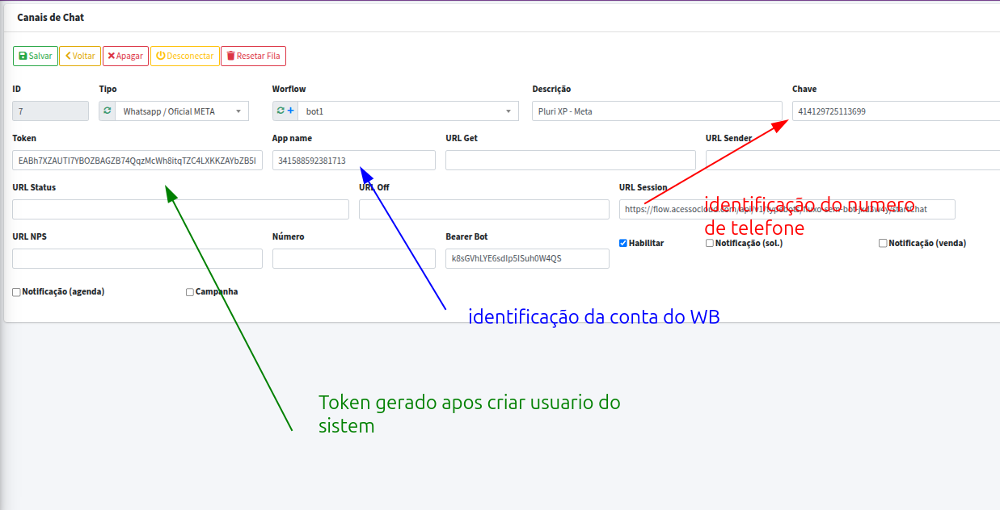
