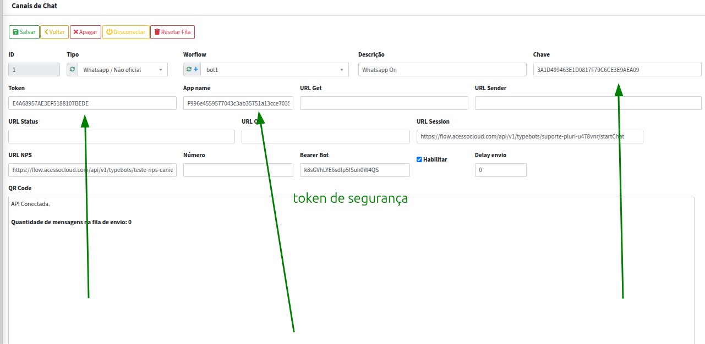

# Integração com Z-API

[Voltar](../README.md)

A integração com o **Z-API** é realizada por meio de um broker não oficial, permitindo o envio e recebimento de mensagens no sistema.

---

## Como integrar?

1. A plataforma Z-API já oferece suporte para integração de forma simples.
   Basta coletar as credenciais fornecidas pela Z-API e inseri-las no sistema.

2. É altamente recomendado consultar a [documentação oficial da Z-API](https://developer.z-api.io/).

3. Após configurar as credenciais, faça a leitura do QR Code pelo aplicativo do WhatsApp para vincular o número à API.

> **Atenção:** Apenas a API não oficial permite integração com grupos.

---

## Tipos de mensagens suportadas

A integração suporta o recebimento e envio dos seguintes tipos de mensagens:

* **Áudio**
* **Arquivo**
* **Texto**
* **Imagem**
* **Vídeo**
* **Contato**
* **Localização**
* **Link**
* **Sticker**
* **Reação**
* **Pedido**
* **Botão** Está integrado a plataforma da z-api diz envio e recebimento por enfrentar problemas
* **Lista** Está integrado a plataforma da z-api diz envio e recebimento por enfrentar problemas

Para integrar um novo tipo de mensagem voce precisa ler um novo webhook 
